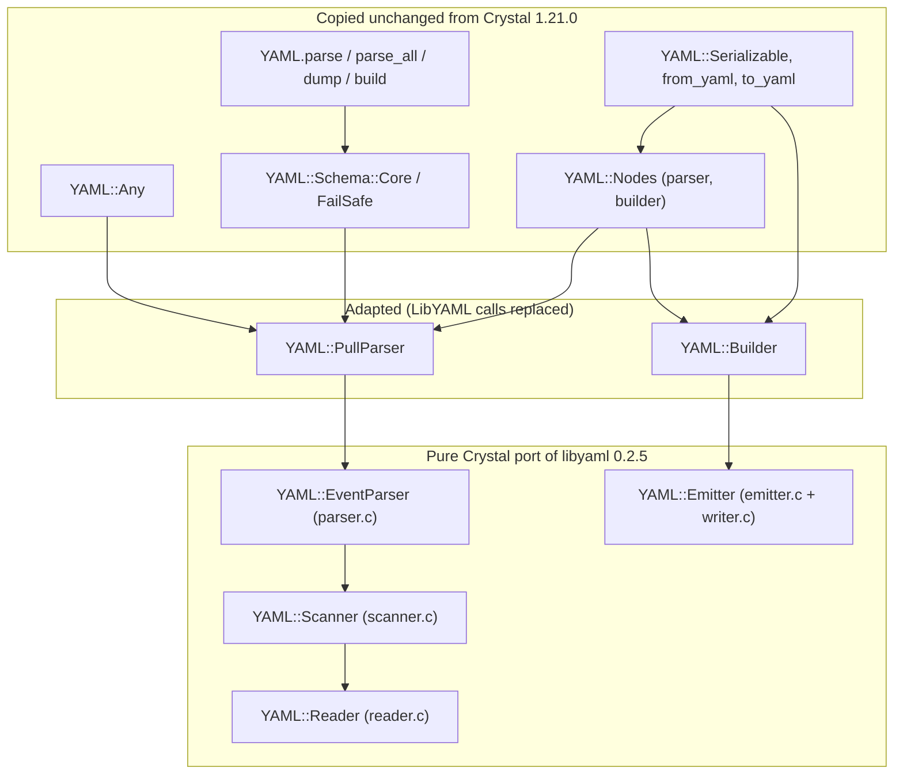
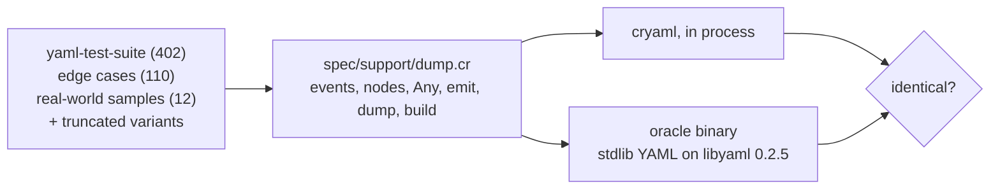

# Architecture

cryaml keeps the stdlib's `YAML` module and swaps out the one layer that called
into C. Everything above `YAML::PullParser` and `YAML::Builder` is the stdlib's
own Crystal code, copied unchanged from Crystal 1.21.0.

## Engine

| File | libyaml source | Role |
| --- | --- | --- |
| `src/yaml/reader.cr` | `reader.c`, scanner buffer macros | Encoding detection (BOM), UTF-8/UTF-16 decoding and validation, `CACHE`/`SKIP`/`READ` primitives, position marks |
| `src/yaml/chars.cr` | `yaml_private.h` `IS_*_AT` macros | Byte-level character classes, shared by scanner and emitter |
| `src/yaml/byte_buffer.cr` | `yaml_string_t` | Reusable scratch strings, including libyaml's `JOIN`/`CLEAR` semantics |
| `src/yaml/token.cr` | `yaml_token_t` | Token struct |
| `src/yaml/scanner.cr` | `scanner.c` | Tokenizer: simple keys, indentation, flow levels, all scalar styles, tags, directives |
| `src/yaml/event.cr` | `yaml_event_t`, `yaml_mark_t` | Event and mark structs |
| `src/yaml/event_parser.cr` | `parser.c` | Iterative state machine from tokens to events |
| `src/yaml/emitter.cr` | `emitter.c`, `writer.c` | Event stream to text, including style selection and line folding |

The port is function by function; each method names the libyaml function it
comes from. It is a translation, not a rewrite, because the goal is identical
behavior: same events, same positions, same error messages, same emitted
text.

### Details that keep behavior identical

- **Chunked decoding.** libyaml validates input in 16 KiB raw chunks, so an
  encoding error deep in a file surfaces at a specific point of the event
  stream. The reader keeps the same chunking (for `String` input it moves a
  window over the string instead of copying it), so errors appear at the same
  event.
- **Reader errors at line 1, column 1.** libyaml never sets a position for
  encoding errors and the stdlib reported its zeroed mark. cryaml does too.
- **Sticky errors.** After a failure every further `read_next` raises the same
  exception, as with the libyaml binding.
- **C strings.** Tags and anchors crossed the C boundary NUL-terminated, so a
  tag containing `%00` was truncated there. `PullParser#tag` and the builder
  reproduce that.
- **Output buffering.** The emitter writes through a 16 KiB buffer that is
  flushed where libyaml flushes (document end, stream end, `Builder#flush`,
  buffer full), using `IO#write_string` like the stdlib's write callback.

### Deliberate differences from libyaml

- **Simple-key scan.** libyaml checks every saved simple key on every token,
  which is quadratic in flow nesting depth. Ported as is, scanning 50,000
  nested `[` took 63 s in the (unoptimized) spec build. The scanner now skips
  the prefix of keys already known to be impossible; it visits the same
  possible keys in the same order, so tokens and errors are unchanged, and the
  same input takes 1.5 s.
- **Invalid UTF-8 in `Builder`.** libyaml's event constructors reject it, the
  binding ignored the failure and re-emitted a stale event (which can end in
  `free(): double free detected`). cryaml raises
  `YAML::Error("Error emitting scalar: invalid UTF-8 string")`.
- **No `finalize`.** `PullParser` and `Builder` hold no native memory, so they
  no longer define finalizers; `close` is a no-op.

## Merging into the stdlib

The layout mirrors the stdlib's `src/yaml/`. Merging means:

1. Delete `src/yaml/lib_yaml.cr`.
2. Add the engine files listed above.
3. Replace `src/yaml.cr`, `src/yaml/pull_parser.cr` and `src/yaml/builder.cr`
   with the adapted versions.
4. Drop `yaml` from the required libraries.

`src/yaml.cr` is the stdlib's `src/yaml.cr` with only `libyaml_version`
changed. The shard's entry point `src/cryaml.cr` only adds a check against
loading the stdlib's `yaml` next to it, and `shim/yaml.cr` lets unmodified
`require "yaml"` code use cryaml. The `src/cryaml/{big,uri,uuid}.cr` mirrors
exist only because the stdlib's `big/yaml`, `uri/yaml` and `uuid/yaml`
`require "yaml"`; after a merge none of these shard files are needed.

## Testing

- `spec/differential_spec.cr` runs every corpus file through both
  implementations in six modes: pull events (from a `String` and from a
  chunked `IO`), `YAML.parse_all`, `YAML::Nodes.parse_all`, re-emitting the
  events through `Builder`, and `to_yaml` round trips, plus three truncations
  of every test-suite file to exercise error paths. Positions, styles, tags,
  anchors, values and error messages must match exactly.
- `spec/builder_differential_spec.cr` generates 400 random, seeded `Builder`
  call sequences (every scalar style, block and flow collections, anchors,
  tags, awkward strings) plus invalid ones, and compares the emitted text and
  errors.
- `spec/std/` is the stdlib's own YAML spec suite, run against cryaml.
- `spec/security_spec.cr` covers deep nesting, alias bombs, multi-megabyte
  scalars, long lines and malformed encodings. `spec/roundtrip_spec.cr` checks
  that parse, dump, parse is stable on the whole corpus.

The oracle needs libyaml installed; it is a test dependency only.
