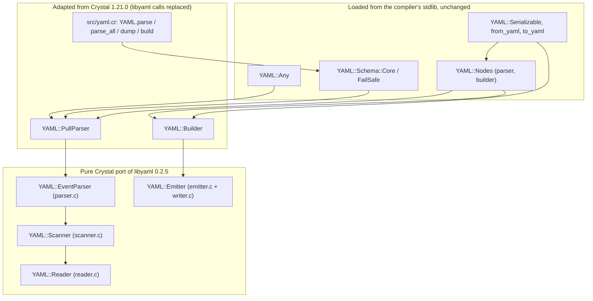
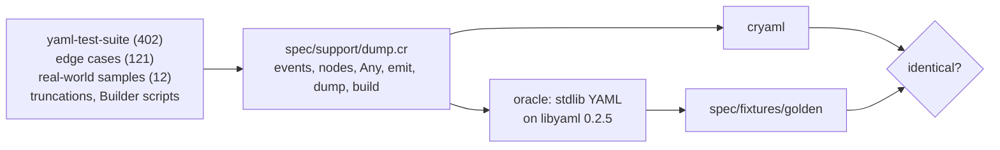

# Architecture

cryaml keeps the stdlib's `YAML` module and swaps out the one layer that called
into C. Everything above `YAML::PullParser` and `YAML::Builder` is the stdlib's
own Crystal code, loaded from the installed compiler: cryaml does not copy it,
so stdlib fixes apply automatically.

## Engine

| File | libyaml source | Role |
| --- | --- | --- |
| `src/yaml/reader.cr` | `reader.c`, scanner buffer macros | Encoding detection (BOM), UTF-8/UTF-16 decoding and validation, `CACHE`/`SKIP`/`READ` primitives, position marks |
| `src/yaml/chars.cr` | `yaml_private.h` `IS_*_AT` macros | Byte-level character classes, shared by scanner and emitter |
| `src/yaml/byte_buffer.cr` | `yaml_string_t` | Reusable scratch strings, including libyaml's `JOIN`/`CLEAR` semantics |
| `src/yaml/collections.cr` | `QUEUE`, `STACK` macros | Token/event queue with mid-queue insertion; state, mark and indent stacks |
| `src/yaml/token.cr` | `yaml_token_t` | Token struct |
| `src/yaml/scanner.cr` | `scanner.c` | Tokenizer: simple keys, indentation, flow levels, all scalar styles, tags, directives |
| `src/yaml/event.cr` | `yaml_event_t`, `yaml_mark_t` | Event and mark structs |
| `src/yaml/event_parser.cr` | `parser.c` | Iterative state machine from tokens to events |
| `src/yaml/emitter.cr` | `emitter.c`, `writer.c` | Event stream to text, including style selection and line folding |

The port is function by function; each method names the libyaml function it
comes from. It is a translation, not a rewrite, because the goal is identical
behavior: same events, same positions, same error messages, same emitted
text.

### Details that keep behavior identical

- **Chunked decoding.** libyaml validates input in 16 KiB raw chunks, so an
  encoding error deep in a file surfaces at a specific point of the event
  stream. The reader keeps the same chunking (a `String` in UTF-8 is
  validated in place, chunk by chunk, instead of being copied; only its last
  few characters move to a padded buffer at the end), so errors appear at
  the same event.
- **Reader errors at line 1, column 1.** libyaml never sets a position for
  encoding errors and the stdlib reported its zeroed mark. cryaml does too.
- **Sticky errors.** After a failure every further `read_next` raises the same
  exception, as with the libyaml binding.
- **C strings.** libyaml returns tag URIs as C strings, so a `%00` escape ends
  them; the scanner cuts them at the NUL, which also decides `%TAG` prefixes
  and the `!` special case the same way. Anchors and tags given to `Builder`
  are cut at NUL like the binding's `char*` arguments.
- **Output buffering.** The emitter writes through a 16 KiB buffer that is
  flushed where libyaml flushes (document end, stream end, `Builder#flush`,
  buffer full), using `IO#write_string` like the stdlib's write callback. As in
  libyaml the buffer is emptied before writing, so output an IO failed to
  write is dropped rather than written twice. The buffer is GC memory, so it
  starts at 1 KiB and grows to 16 KiB when that fills up; it is still flushed
  only when 16 KiB would be full, so the IO sees the same writes.
- **`yaml_check_utf8`.** `Builder` accepts exactly what libyaml's event
  constructors accept, including encoded surrogates and code points above
  U+10FFFF, which the emitter writes as escapes.

### Performance techniques

The hot loops keep libyaml's structure but do less per character:

- the reader validates eight bytes at a time for printable ASCII and falls
  back to the per-byte path at the first other byte, so every error fires at
  the same byte;
- where the C code does `READ`/`SKIP` + `CACHE`, or `WRITE` + `FLUSH`, per
  character, the scanner and emitter copy runs of ASCII at once. Runs stop
  before a refill or flush would happen, so those still happen at the same
  characters. Indentation, plain scalars (block and flow context) and quoted
  scalars are scanned eight bytes at a time (SWAR flags; on big-endian
  targets a run can only end early);
- single-line plain scalars are taken straight from the input string (one
  copy, with their character count, so `String#size` needn't rescan them).
  When such a scalar visibly ends (a simple key's `: `, a flow indicator, or
  a line break followed only by LF breaks and spaces before a smaller
  indentation) it is returned before the general loop and its scratch
  strings are set up; a one-line quoted scalar without escapes is taken
  from the input the same way. These shortcuts only apply while enough
  characters are decoded that every `CACHE` they skip would be a no-op;
- the parser builds each event in place, where `PullParser` reads it, and
  `SKIP_TOKEN` leaves the next token available unless a simple key is
  pending (the re-check libyaml makes there is a no-op). Possible simple
  keys' token numbers grow with their flow level, so "is a key pending" is
  one comparison with the first one's;
- bounds on the live simple keys make most stale-key checks free, and they
  reset as soon as no key is possible;
- `EventParser` is a subclass of `Scanner` (itself a `Reader`), one object
  like libyaml's `yaml_parser_t`; `Queue` and `Stack` are structs held in
  it, like libyaml's embedded `QUEUE`/`STACK` fields, so there is no
  per-push call, allocation or pointer chase. The stream's simple key is a
  field; only flow levels push theirs. Dequeued event slots are cleared so
  their strings can be collected; token slots are not (as in libyaml, the
  strings live on in events);
- the default `%TAG` directives are looked up after a document's own
  instead of being copied into its list, and `PullParser` creates its
  anchor bookkeeping only at the first anchor;
- position, index and token counters use wrapping arithmetic where they
  provably cannot overflow;
- the emitter takes events by pointer (`yaml_event_t *`), and an event that
  needs no lookahead is processed without going through the queue when
  nothing is queued, which is what libyaml's queue loop would do at once;
- most scalars are printable ASCII without breaks, edge spaces or
  indicators; `analyze_scalar` recognizes them with two bit sets in one pass,
  and a plain one-word scalar is copied to the buffer at once.

### Deliberate differences from libyaml

- **Simple-key scan.** libyaml checks every saved simple key on every token,
  which is quadratic in flow nesting depth. Ported as is, scanning 50,000
  nested `[` took 63 s in the (unoptimized) spec build. The scanner skips the
  prefix of keys already known to be impossible; it visits the same possible
  keys in the same order, so tokens and errors are unchanged, and the same
  input takes about a second.
- **BLOCK_END runs.** Leaving a structure *n* levels deep makes libyaml
  queue *n* BLOCK_END tokens at once (the queue grows to 512 tokens for the
  deep benchmark). cryaml queues one entry that `SKIP_TOKEN` hands out *n*
  times; token numbers count queue entries, so simple keys still land at
  the same positions, and the parser sees the same tokens.
- **Malformed UTF-8 in `Builder`.** libyaml's event constructors reject it;
  the binding ignored the failure and re-emitted the previous event (which can
  end in `free(): double free detected`, or in an unrelated error). cryaml
  raises `YAML::Error("Error emitting scalar: invalid UTF-8 string")`. Besides
  invalid strings passed by the program, this happens when re-emitting a
  parsed node whose tag's `%`-escapes decode to an overlong sequence
  (`!<tag:%C0%A9>`): both scanners accept that tag, as libyaml only checks
  escaped octets for structure. The fuzzer found it.
- **No `finalize`.** `PullParser` and `Builder` hold no native memory, so they
  no longer define finalizers; `close` is a no-op.

## Merging into the stdlib

The layout mirrors the stdlib's `src/yaml/`. Merging means:

1. Delete `src/yaml/lib_yaml.cr`.
2. Add the engine files listed above.
3. Replace `src/yaml.cr`, `src/yaml/pull_parser.cr` and `src/yaml/builder.cr`
   with the adapted versions (in `src/yaml.cr`, the requires go back to the
   stdlib's relative globs, as its header shows).
4. Drop `yaml` from the required libraries.

Shard-only files, unneeded after a merge: `src/cryaml.cr` (entry point, plus
a check against loading the stdlib's `yaml` next to cryaml), `shim/yaml.cr`
(lets unmodified `require "yaml"` code use cryaml) and
`src/cryaml/{big,uri,uuid}.cr` (the stdlib's `big/yaml`, `uri/yaml` and
`uuid/yaml` `require "yaml"`).

`scripts/stdlib_drift.cr` fails when a file cryaml replaces changes upstream
or the stdlib's `yaml.cr` starts loading a file `src/yaml.cr` doesn't.

## Testing

- **Differential specs.** `spec/differential_spec.cr` runs every corpus file
  in six modes: pull events (from a `String` and from a chunked `IO`),
  `YAML.parse_all`, `YAML::Nodes.parse_all`, re-emitting the events through
  `Builder`, and `to_yaml` round trips, plus three truncations of every
  test-suite file. `spec/builder_differential_spec.cr` covers 3,862 `Builder`
  scripts: 400 random ones, every value x scalar style x position, invalid
  sequences, byte strings libyaml accepts, NUL in anchors and tags, and
  line-width boundaries per style. Expected output is recorded in
  `spec/fixtures/golden` from libyaml 0.2.5, so these specs run on every
  platform; `CRYAML_ORACLE=1` compares with the live oracle instead (CI does
  on Linux and macOS) and checks the recordings are current,
  `CRYAML_ORACLE=update` rewrites them. The oracle refuses any libyaml but
  0.2.5 (Crystal's own macOS build links an older one, which differs) and
  refuses to be cryaml itself (a `CRYSTAL_PATH` with the shim would make it
  so); it is rebuilt when the compiler, `CRYSTAL_PATH` or libyaml prefix
  change.
- **Fuzzing.** `fuzz/fuzz.cr` mutates the corpus and generates `Builder`
  scripts, runs both implementations as separate processes (so crashes and
  hangs on either side are caught) and minimizes every difference. A nightly
  workflow runs four shards.
- **Upstream specs.** `spec/std/` holds Crystal 1.21.0's YAML specs; CI also
  runs `spec/std/yaml` of the latest release and of nightly against cryaml.
- **Downstream.** CI runs the test suites of shards, ameba and crystal-i18n
  on cryaml through the shim.
- **Coverage.** `scripts/coverage.sh` (kcov) enforces per-file floors: what
  the suite doesn't reach is unreachable through the public API (emitter
  directives and canonical mode, defensive buffer growth).
- **Memory safety.** The engine uses raw pointers in its hot loops.
  `scripts/memcheck.sh` builds with `-Dgc_none` (plain malloc, so
  out-of-bounds access shows up) and runs the spec suite and fuzzer-generated
  inputs under valgrind's memcheck. CI fails on any error not matched by
  `scripts/memcheck.supp` (two known stdlib bugs and PCRE2 JIT reads, each
  pinned to their frames), and when either run doesn't complete.
- **Hostile input and round trips.** `spec/security_spec.cr` covers deep
  nesting, alias bombs, multi-megabyte scalars, long lines and malformed
  encodings; `spec/roundtrip_spec.cr` checks that parse, dump, parse is
  stable on the whole corpus.
- **Platforms.** CI runs everything on Linux x86_64/aarch64, macOS
  arm64/x86_64, Windows MSVC and MinGW-w64 and Alpine (static musl binary),
  and everything but the `big` serialization specs (no GMP) in the
  interpreter. wasm32-wasi has no exceptions, so there CI diffs the dumps of
  every input that parses without error against the native run.
