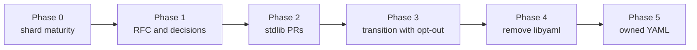

# Roadmap to the stdlib

The goal is for cryaml to replace the libyaml binding inside Crystal's
stdlib, so `require "yaml"` stays the same and libyaml disappears from the
required libraries.

## Phase 0: shard maturity (done)

| Item | Evidence |
| --- | --- |
| Platform matrix | CI runs the full suite on Linux x86_64 and aarch64, macOS arm64 and x86_64, Windows MSVC and MinGW-w64, Alpine (musl, static binary) and in the interpreter. wasm32-wasi has no exception support, so CI dumps every corpus input that parses without error on wasmtime and diffs it against the native run. |
| Behavior parity | Every corpus input (yaml-test-suite, 121 edge cases, 12 real-world files, truncations) and 3,805 Builder scripts match libyaml 0.2.5 exactly: events with positions, node trees, `YAML::Any`, emitted text, errors. Recorded output in `spec/fixtures/golden`; CI also compares live against libyaml 0.2.5 on Linux and macOS. |
| Line-by-line review | Reader, scanner, parser and emitter compared with libyaml function by function. Four divergences found and fixed, each reproduced first (NUL in `%TAG` prefixes, `yaml_check_utf8` semantics in `Builder`, flush order on IO errors, Int32 overflows on inputs above 1 GiB). |
| Fuzzing | `fuzz/fuzz.cr` mutates the corpus and generates Builder scripts; both sides run as separate processes so crashes and hangs are caught. A nightly workflow runs four shards. See the README for the latest local campaign. |
| Coverage | kcov, enforced per file in CI: scanner 100%, Builder and PullParser 100%, parser 99.2%, reader 98.7%, emitter 95.0%. The rest is unreachable through the public API (emitter directives and canonical mode, defensive buffer growth). |
| Upstream stdlib | cryaml loads the stdlib's own Any, Nodes, schema and serialization layers, so fixes like 1.21.1's `YAML::Any#hash` fix apply automatically. CI runs `spec/std/yaml` of 1.21.0, the latest release and nightly against cryaml, and fails if a file cryaml replaces changes upstream. |
| Real projects | shards, ameba, crystal-i18n and totem run their test suites on cryaml with identical results to the stdlib (2,769 examples); shards, ameba and i18n run in CI. Unmodified code uses cryaml through `shim/yaml.cr`. |
| Mixed requires | Loading the stdlib's `yaml` next to cryaml fails to compile, with an explanation when the stdlib came first. |
| Performance | Fewer instructions than libyaml on every measured workload (callgrind); wall-clock tables for four platforms in [PERFORMANCE.md](PERFORMANCE.md). |

## Phase 1: RFC and decisions

- Write the RFC in `crystal-lang/rfcs`: motivation (no C dependency, Windows
  and wasm distribution, debuggability), the evidence above, risks.
- Decide:
  - **Transition flag.** Precedent: the PCRE2 move kept `-Duse_pcre` for a
    while. A `-Duse_libyaml` opt-out for one minor release is the likely
    ask.
  - **Internal names.** The engine adds `YAML::Reader`, `Scanner`, `Token`,
    `TokenKind`, `Mark`, `Event`, `EventParser`, `Emitter`, `ByteBuffer`,
    `Chars`, `Queue`, `Stack` (all `:nodoc:`). Moving them under one
    namespace (for example `YAML::Engine`) is cheap now and breaking later.
  - **libyaml quirks.** Reader errors at line 1, column 1; tags cut at a
    `%00`. Keep them for the switch, fix them later as separate behavior
    changes?
  - **`YAML.libyaml_version`.** Returns 0.2.5 now; deprecate.
- Maintainer for the engine (tracks libyaml upstream fixes).

Findings from Phase 0 worth raising with core, independent of cryaml:

- **libyaml differs by platform today.** Crystal 1.21.0's macOS tarball
  links libyaml 0.1.6 by default; Linux distros and Homebrew ship 0.2.5.
  In the first macOS CI run, comparing against the default-linked 0.1.6
  failed 534 of 5,561 examples (error text, `%YAML 1.2`, `:` in flow plain
  scalars, emitter output such as `--- \n...` for empty documents), so stdlib
  YAML already behaves differently on macOS.
- **Recursion in the YAML layers.** `YAML::Parser` (behind `YAML.parse`,
  `Nodes.parse`, `from_yaml`) recurses once per nesting level.
  `PullParser#max_nesting` (512) keeps native stacks safe, but on wasm32 the
  default 64 KiB stack has no guard page and overflows at about 40 levels,
  silently corrupting the heap. Making the tree builder iterative would fix
  it for every target.
- **`YAML::Any#hash` on self-referencing aliases** overflowed the stack in
  1.21.0 (fixed in 1.21.1); the fuzzer hit it within minutes, which argues
  for running it upstream.

## Phase 2: stdlib PRs

1. The engine alone, unused, with its unit and differential specs (golden
   files, since stdlib CI won't have libyaml forever).
2. Switch `PullParser` and `Builder`; old binding behind the transition flag.
3. REUSE/SPDX headers for the libyaml-derived files, NOTICE, CHANGELOG.
4. Docs: required libraries page, migration notes.

## Phase 3: transition (one minor release)

The pure engine is the default, `-Duse_libyaml` restores the binding.
Release notes list the behavior differences: `finalize` removed from
`PullParser` and `Builder`, malformed UTF-8 given to `Builder` raises
instead of re-emitting a stale event.

## Phase 4: remove libyaml

Delete `lib_yaml.cr` and the flag; drop libyaml from packaging (Windows
`yaml.dll`, distro dependencies, Docker images).

## Phase 5: owned YAML

Better error positions and messages, cheaper value creation, and YAML 1.2
core schema as an opt-in (separate RFC).
