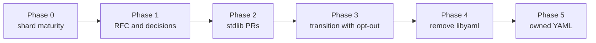

# Roadmap to the stdlib

The goal is for cryaml to replace the libyaml binding inside Crystal's
stdlib, so `require "yaml"` stays the same and libyaml disappears from the
required libraries.

## Phase 0: shard maturity (done)

| Item | Evidence |
| --- | --- |
| Platform matrix | CI runs the full suite on Linux x86_64 and aarch64, macOS arm64 and x86_64, Windows MSVC and MinGW-w64 and Alpine (musl, static binary), and everything but the `big` serialization specs (no GMP) in the interpreter. wasm32-wasi has no exception support, so CI dumps every corpus input that parses without error on wasmtime and diffs it against the native run. |
| Behavior parity | Every corpus input (yaml-test-suite, 121 edge cases, 12 real-world files, truncations) and 3,805 Builder scripts match libyaml 0.2.5 exactly: events with positions, node trees, `YAML::Any`, emitted text, errors. Recorded output in `spec/fixtures/golden`; CI also compares live against libyaml 0.2.5 on Linux and macOS. |
| Line-by-line review | Reader, scanner, parser and emitter compared with libyaml function by function. Four divergences found and fixed, each reproduced first (NUL in `%TAG` prefixes, `yaml_check_utf8` semantics in `Builder`, flush order on IO errors, Int32 overflows on inputs above 1 GiB). The later performance fast paths were reviewed on their own against the code they replace: no differences, including the IO write sequence of the emitter (sizes and contents of every write), and two planted off-by-one bugs were caught. |
| Second review (after 0.1.0) | Four reviewers, one per layer, again against libyaml's C source, with differential probes (about 43,000 generated scanner inputs, 130 reader edge cases, emitter IO write sequences, 38 parser/IO edge cases): no divergence in the state machines. Found and fixed in 0.1.1: the mixed-require check missed `require "yaml"` after cryaml (which then silently linked libyaml); scalars above 1 GiB overflowed the scratch buffer; the emitter's unused line counter overflowed after 2^31 line breaks; consumed tokens and events stayed reachable from the queues; plus dead code. |
| Fuzzing | `fuzz/fuzz.cr` mutates the corpus (including mutations at the reader's 16 KiB chunk boundaries) and generates Builder scripts; both sides run as separate processes so crashes and hangs are caught, and every difference is minimized. Overnight campaign on 2026-10-09/10: about 1.22 billion cases in eight shards. Findings: the `%TAG` `%00` divergence (fixed, also found by the review), a stack overflow in the stdlib's own `YAML::Any#hash` on self-referencing aliases that libyaml's binding hits too (fixed upstream in 1.21.1), and tags whose `%`-escapes decode to overlong UTF-8, which only differ when re-emitted through `Builder` (the documented malformed-UTF-8 difference). Nothing else. A nightly workflow runs four more shards. Two deliberately planted bugs were found within the first batch. |
| Coverage | kcov, measured in CI: scanner 100%, Builder and PullParser 100%, parser 99.2%, reader 99.0%, emitter 95.0%, 98.25% overall; CI fails below per-file floors (scanner 99%, parser 98%, reader 97%, emitter 94%, Builder and PullParser 100%). The rest is unreachable through the public API (emitter directives and canonical mode, defensive buffer growth). |
| Memory safety | valgrind memcheck with `-Dgc_none` over the spec suite and 20,000 fuzzer-generated cases: no errors in engine code. The only reports come from two stdlib bugs that Boehm's allocation slack hides (see Findings); they are suppressed by frame in `scripts/memcheck.supp`, and CI fails on anything else or on an incomplete run. |
| Upstream stdlib | cryaml loads the stdlib's own Any, Nodes, schema and serialization layers, so fixes like 1.21.1's `YAML::Any#hash` fix apply automatically. CI runs `spec/std/yaml` of 1.21.0, the latest release and nightly against cryaml, and checks that the files cryaml replaces haven't changed upstream; that check fails CI for releases and is reported, non-blocking, for nightly. |
| Real projects | 22 projects run their test suites on cryaml with results identical to the stdlib's, failures included: shards, ameba, crystal-i18n, totem, Invidious, Amber, Athena (serializer), coverage-reporter, crinja, crystalizer, crystalline, deadfinder, hwaro, Lucky, Mint, money, mosquito, noir, oq, raven.cr, spider-gazelle and zap (about 44,600 examples; the failures need fossil/hg, Redis, xmllint or a git submodule, in both). shards, ameba and i18n run in CI. Unmodified code uses cryaml through `shim/yaml.cr`. |
| Mixed requires | Loading the stdlib's `yaml` next to cryaml fails to compile with an explanation, in either order (a `finished` hook; checked in CI). |
| Performance | Faster than the libyaml binding on every workload on Linux x86_64/aarch64 and macOS arm64/x86_64 (`YAML.parse_all` 1.25x-3.09x; one emitter tie at 0.99x), and fewer instructions on every workload measured with callgrind except `to_yaml` of the flow-heavy document (about 2% more). Tables in [PERFORMANCE.md](PERFORMANCE.md). |

## Phase 1: RFC and decisions

- Write the RFC in `crystal-lang/rfcs`: motivation (no C dependency, Windows
  and wasm distribution, debuggability), the evidence above, risks.
- Decide:
  - **Transition flag.** Precedent: the PCRE2 move kept `-Duse_pcre` for a
    while. A `-Duse_libyaml` opt-out for one minor release is the likely
    ask.
  - **Internal names.** The engine adds `YAML::Reader`, `Scanner`, `Token`,
    `TokenKind`, `Mark`, `Event`, `EventParser`, `Emitter`, `ByteBuffer`,
    `Chars`, `Queue`, `Stack` (all `:nodoc:`). Moving them under one
    namespace (for example `YAML::Engine`) is cheap now and breaking later.
  - **libyaml quirks.** Reader errors at line 1, column 1; tags cut at a
    `%00`. Keep them for the switch, fix them later as separate behavior
    changes?
  - **`YAML.libyaml_version`.** Returns 0.2.5 now; deprecate.
- Maintainer for the engine (tracks libyaml upstream fixes).

Findings from Phase 0 worth raising with core, independent of cryaml:

- **libyaml differs by platform today.** Crystal 1.21.0's macOS tarball
  embeds a static libyaml 0.1.6 (`distribution-scripts` pins
  `default_version '0.1.6'` in `omnibus/config/software/libyaml.rb`), and
  programs built with that package link it even with Homebrew's 0.2.5
  installed (`YAML.libyaml_version` prints 0.1.6 on `macos-15` after
  `brew install libyaml`). Linux packages embed no libyaml, so programs there
  get the distro's 0.2.5. In the first macOS CI run, comparing against 0.1.6
  failed 534 of 5,561 examples (error text, `%YAML 1.2`, `:` in flow plain
  scalars, emitter output such as `--- \n...` for empty documents), so stdlib
  YAML already behaves differently on macOS.
- **Recursion in the YAML layers.** `YAML::Parser` (behind `YAML.parse`,
  `Nodes.parse`, `from_yaml`) recurses once per nesting level.
  `PullParser#max_nesting` (512) keeps native stacks safe, but on wasm32 the
  default 64 KiB stack has no guard page and overflows at about 40 levels,
  silently corrupting the heap. Making the tree builder iterative would fix
  it for every target.
- **`YAML::Any#hash` on self-referencing aliases** overflowed the stack in
  1.21.0 (fixed in 1.21.1); the fuzzer hit it within minutes, which argues
  for running it upstream.
- **Two out-of-bounds accesses in the stdlib**, found because memcheck runs
  with `-Dgc_none`, where Boehm's allocation slack doesn't hide them (both
  still on master):
  - `String::Builder#increase_capacity_by` doesn't reserve the trailing zero
    byte that `#initialize` reserves, so when the content fills the buffer
    exactly, `#to_s` writes one byte past the allocation.
    `String.build(43) { |io| io << "x" * 44 }` repeated 1,000 times aborts
    with glibc's "corrupted size vs. prev_size" under `-Dgc_none`.
  - `Float::FastFloat`'s `parse_infnan` compares `"inf"` outside the
    `last - first >= 3` guard that upstream fast_float has, reading up to two
    bytes past short inputs such as `"-x".to_f64?`.

## Phase 2: stdlib PRs

1. The engine alone, unused, with its unit and differential specs (golden
   files, since stdlib CI won't have libyaml forever).
2. Switch `PullParser` and `Builder`; old binding behind the transition flag.
3. REUSE/SPDX headers for the libyaml-derived files, NOTICE, CHANGELOG.
4. Docs: required libraries page, migration notes.

## Phase 3: transition (one minor release)

The pure engine is the default, `-Duse_libyaml` restores the binding.
Release notes list the behavior differences: `finalize` removed from
`PullParser` and `Builder`, malformed UTF-8 given to `Builder` raises
instead of re-emitting a stale event.

## Phase 4: remove libyaml

Delete `lib_yaml.cr` and the flag; drop libyaml from packaging (Windows
`yaml.dll`, distro dependencies, Docker images).

## Phase 5: owned YAML

Better error positions and messages, cheaper value creation, and YAML 1.2
core schema as an opt-in (separate RFC).
